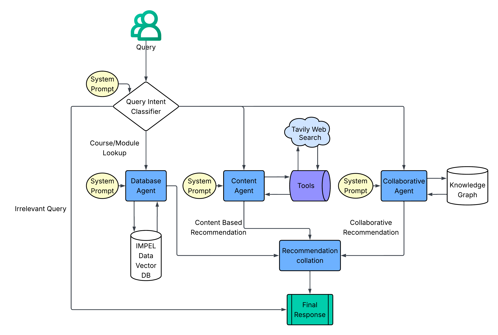
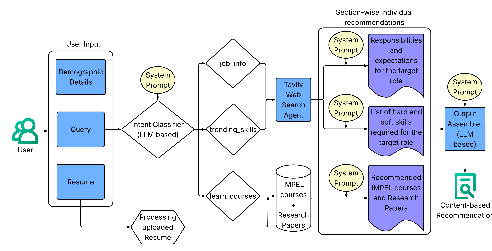
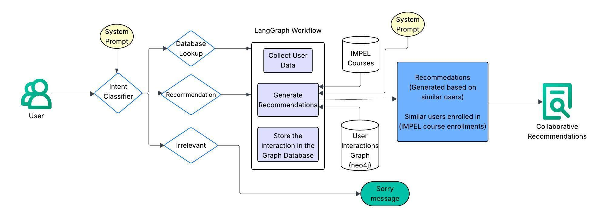

# Multi-Agent Intelligence Orchestration System

A production-grade implementation of orchestrated multi-agent AI architecture demonstrating personalization through intent classification, hybrid recommendation strategies, and dynamic external intelligence integration. This system implements AI engineering patterns using educational pathways as the validation domain, combining LLM-powered orchestration with graph-based collaborative intelligence and real-time market signal incorporation.

## System Architecture Overview

This implementation demonstrates multi-agent orchestration patterns where autonomous AI agents collaborate through intelligent query routing. The system employs intent classification to dynamically dispatch queries to specialized processing pipelines, showcasing how AI systems achieve modularity, scalability, and domain expertise through agent specialization. Each agent maintains distinct processing capabilities while contributing to a unified intelligence framework.

### AI Engineering Pipeline Architecture

The system implements LangGraph-based orchestration for managing distributed agent workflows and maintaining state consistency across parallel processing pipelines:



The orchestration layer performs intent classification through LLM-powered semantic analysis, dynamically routing queries to specialized agents based on detected intent patterns. This demonstrates production-grade implementation of multi-agent coordination, where database agents, collaborative filtering engines, and content analysis systems operate as autonomous units within a cohesive intelligence framework.

### Content-Based Intelligence Agent

The Content Agent demonstrates multi-source intelligence fusion for context-aware analysis, integrating structured documents, real-time web intelligence, and academic knowledge bases:



This agent implements multi-modal document parsing (PDF/DOCX formats), real-time external intelligence gathering through web search APIs, and semantic similarity search across vectorized knowledge repositories. The architecture showcases production patterns for combining heterogeneous data sources—structured user profiles, dynamic market signals, and curated academic research—into unified intelligence outputs through vector space operations and LLM-powered synthesis.

### Graph-Based Collaborative Intelligence Engine

The Collaborative Agent implements graph-based similarity analysis for peer-driven intelligence generation using Neo4j's native graph processing capabilities:



This agent constructs high-dimensional user embeddings (1024-dimensional vectors) from multi-faceted profile data, executing graph traversal algorithms to identify similarity clusters and behavioral patterns. The implementation demonstrates production-grade collaborative filtering through graph databases, leveraging node similarity algorithms, community detection, and path-finding operations to extract intelligence from peer interaction networks and historical success patterns.

## Core AI Capabilities

- **Intent Classification & Routing**: Dynamic query analysis and dispatch to specialized processing pipelines through semantic understanding
- **Multi-Modal Processing Pipeline**: Document parsing across formats (PDF/DOCX) with natural language processing for unified context extraction
- **External Intelligence Integration**: Real-time API connections for dynamic market signal incorporation and trend analysis
- **Vector-Based Knowledge Retrieval**: FAISS-powered semantic search across curated knowledge repositories for evidence-based intelligence generation
- **Graph-Based Collaborative Analysis**: Neo4j graph operations for similarity computation, pattern detection, and peer-driven insights
- **Production-Grade Infrastructure**: Structured logging, error handling, and observability patterns for enterprise deployment

## Getting Started

### Prerequisites

- Docker and Docker Compose

### 1. Configuration

First, clone the repository and set up your API keys:

```bash
git clone <repository-url>
cd course-recommendation-system/docker
```

Create your environment configuration file from the example:

```bash
cp .env.example .env
```

Edit the `.env` file to add your API keys and credentials:

**Required API Keys:**
- `COHERE_API_KEY` - Your Cohere API key
- `TAVILY_API_KEY` - Your Tavily API key
- `OPENAI_API_KEY` - Your OpenAI API key (required for LangSmith integration)
- `LANGSMITH_API_KEY` - Your LangSmith API key for tracing and observability

**Neo4j Database Access:**
- `NEO4J_PASSWORD` - **Contact repository creators for credentials** to access the full course and user dataset
- Default password provided works but has no data

**Optional Settings:**
- MySQL configuration (defaults work automatically)

Get your API keys from:
- **Cohere**: [dashboard.cohere.ai/api-keys](https://dashboard.cohere.ai/api-keys) for AI/LLM tools/functions. 
- **Tavily**: [app.tavily.com](https://app.tavily.com) for web search capabilities
- **OpenAI**: [platform.openai.com/api-keys](https://platform.openai.com/api-keys) for LangSmith integration
- **LangSmith**: [smith.langchain.com](https://smith.langchain.com) for tracing and debugging

### 2. Start the Application

Once your `.env` file is configured, start the entire application using Docker Compose:

```bash
# Start all containers (MySQL, Neo4j, and the application)
docker compose up

# In another terminal, verify all containers are running
docker compose ps
```

**Important:** Run without `-d` flag to see real-time logs in your terminal. This is essential for development and debugging. Use a separate terminal tab for other commands. See the [Logging System](#logging-system) section for more details about logs.

**Note:** Docker handles ALL dependencies automatically - no local Python installation or virtual environment needed. The application container includes all required Python packages.

### 3. Access Web Interfaces

Once running, you can access these web-based services:

- **Main Application**: [http://localhost:7860](http://localhost:7860) - Gradio interface for course recommendations
- **Neo4j Browser**: [http://localhost:7474](http://localhost:7474) - Graph database interface to explore user relationships and data
- **MySQL** (if needed): Connect via your preferred MySQL client to `localhost:3306`

**Neo4j Login**: Use username `neo4j` and the password you set in your `.env` file (default: `neo4jpassword`)

## Developer Tools

### LangSmith MCP Integration

The project includes Model Context Protocol integration for LangSmith development tools. This provides direct access to dataset management, evaluation testing, and debugging traces through Claude Desktop during development.

**Setup**:
1. Ensure your `LANGSMITH_API_KEY` is configured in `docker/.env`
2. Source the MCP environment setup script:
   ```bash
   source .mcp/setup-mcp.sh
   ```
   This script automatically pulls the LangSmith API key from your Docker environment file, maintaining a single source of truth.

3. Configure Claude Desktop with the MCP server settings (see [.mcp/README.md](.mcp/README.md))

**Detailed Documentation**: See [.mcp/README.md](.mcp/README.md) for complete MCP tools documentation and usage examples.

### Logging System

The system implements a comprehensive logging structure via `SystemLogger`. Logs are printed to the console output of the Docker container, making them available in real-time when running the container in attached mode (without detached mode).

```python
from utils.logger import SystemLogger

# Different log levels with automatic context
SystemLogger.info("Processing user query", {
    'user_id': user_id,
    'query_preview': query[:50]
})

SystemLogger.error("Database connection failed", 
    exception=e,
    context={'connection_attempt': attempt_count}
)
```

**Log Hierarchy**: `DEBUG` → `INFO` → `ERROR` with automatic file rotation in `logs/` directory.

### Error Handling

Structured exception handling with custom exception types:

```python
from utils.exceptions import WorkflowError, APIRequestError

try:
    result = process_query(query)
except APIRequestError as e:
    SystemLogger.error("External API failure", exception=e)
    return fallback_response()
```

**Available Exceptions**: `WorkflowError`, `AgentExecutionError`, `APIRequestError`, `DatabaseConnectionError`, `ConfigurationError`

### LangSmith Observability

The system integrates LangSmith for comprehensive tracing and debugging across all workflows:

```python
# Automatic tracing of agent workflows and LLM calls
LANGSMITH_API_KEY=your-langsmith-api-key-here
LANGCHAIN_PROJECT=IMPEL
```

**Traced Components**: Intent classification, multi-agent workflows (Database, Collaborative, Content), LLM interactions, similarity searches, and state transitions.

**Dashboard Access**: View traces at [smith.langchain.com](https://smith.langchain.com) for debugging agent decisions and performance monitoring.

## System Architecture Components

- **Workflow Orchestration**: LangGraph implementation for distributed agent coordination and state management
- **Data Persistence Layer**: MySQL for structured data storage, Neo4j for graph-based relationship modeling and traversal operations
- **Vector Operations**: FAISS indexing for high-dimensional similarity search across knowledge repositories
- **Language Model Integration**: LLM APIs for semantic analysis, intent classification, and natural language generation
- **Interface Layer**: Gradio-based web interface supporting multi-modal inputs and real-time interaction

## Future Explorations

### Advanced Prompt Engineering

LangSmith observability infrastructure enables systematic optimization of multi-agent communication:

- **A/B Testing Infrastructure**: Evaluation datasets for comparing prompt variations across agent workflows, measuring output quality and system performance metrics
- **Prompt Optimization Pipeline**: Real-time testing interfaces for intent classification accuracy, content generation quality, and collaborative filtering precision
- **Performance Analytics**: Dashboard-driven analysis of prompt effectiveness, pattern identification in successful versus failed agent interactions
- **Inter-Agent Communication Optimization**: Trace-driven refinement of prompt handoffs between specialized agents, minimizing context loss and maximizing workflow coherence

### Model Specialization and Adaptation

Comprehensive tracing infrastructure enables domain-specific model optimization:

- **Domain-Specific Fine-Tuning**: Leverage interaction patterns and successful agent traces for parameter-efficient fine-tuning using LoRA/QLoRA architectures
- **Evaluation-Driven Training Pipeline**: Create training datasets from high-quality agent interactions, ensuring specialized models maintain performance benchmarks

### Architecture-Level Optimization

Trace-driven system optimization for production performance:

- **Intent Classification Architecture**: Analyze misclassification patterns to refine query understanding models and agent routing mechanisms
- **Multi-Agent Communication Layers**: Optimize embedding architectures and attention mechanisms based on successful interaction patterns
- **State Representation Learning**: Leverage state transition data to improve vector representations for user modeling and similarity computation
- **Performance-Driven Design**: Identify computational bottlenecks through performance metrics, guiding architectural decisions for low-latency operation

### MCP Ecosystem Integration

Extend Model Context Protocol integration for comprehensive AI assistant interoperability:

- **API Surface Exposure**: MCP servers providing programmatic access to search, recommendation generation, and interaction data for AI assistant ecosystems
- **Agent Workflow Access**: MCP tools exposing DatabaseAgent, CollaborativeAgent, and ContentAgent pipelines for external system integration
- **Development Tool Suite**: MCP servers for debugging, evaluation dataset creation, and performance monitoring enabling rapid iteration cycles

## License

This project is licensed under the MIT License.